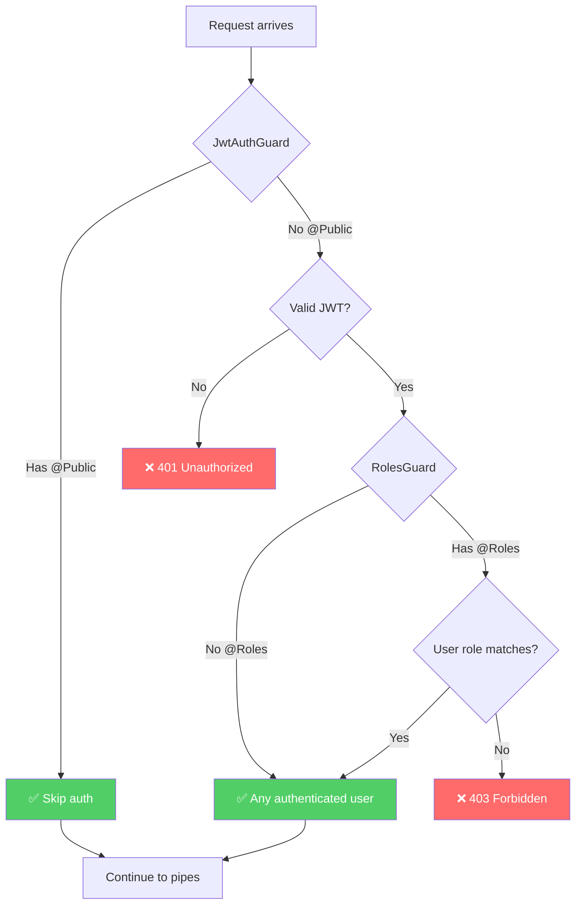
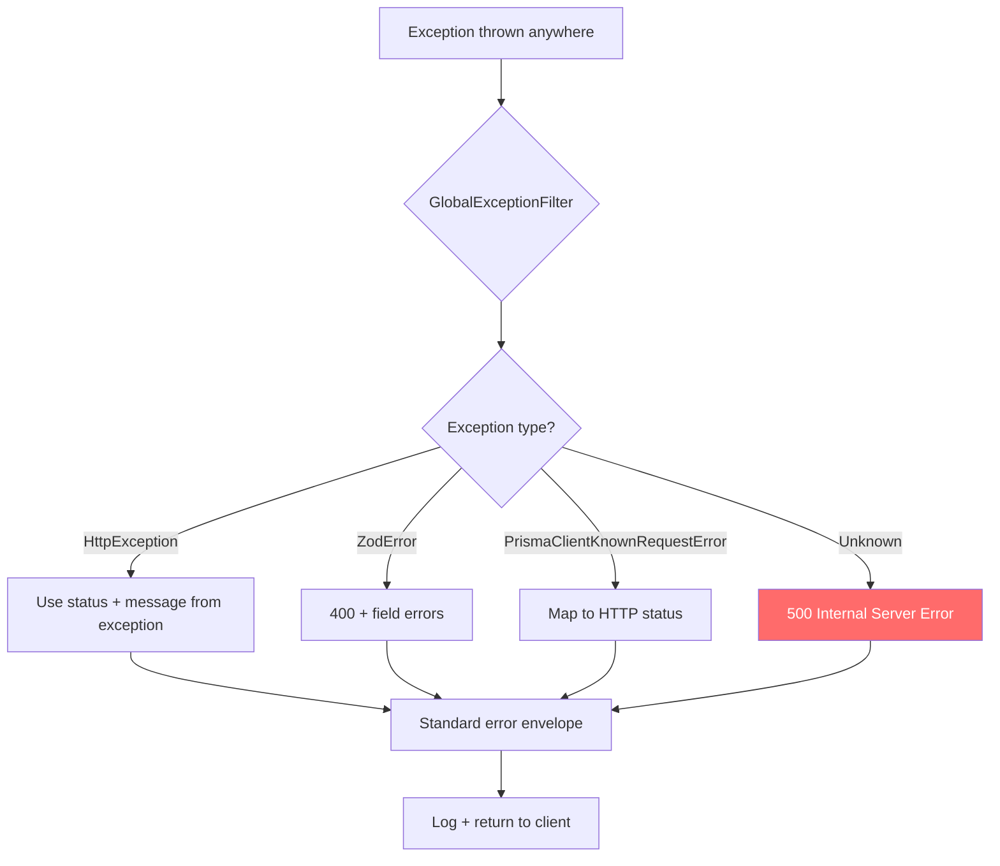
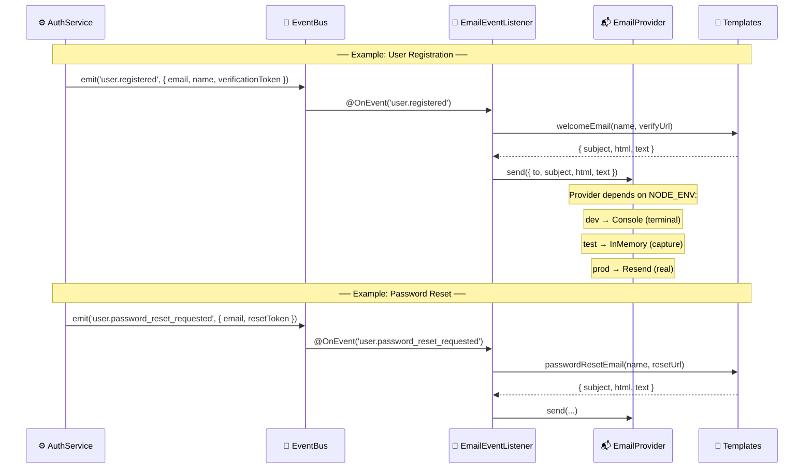
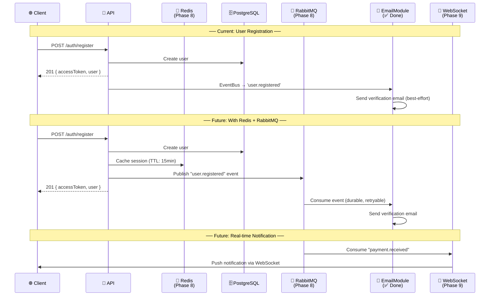

# Request Lifecycle

> How an HTTP request flows through the Paisa API, from incoming connection to database and back.
> This diagram evolves as we add infrastructure (Redis, RabbitMQ, WebSockets, etc.).

## The Full Picture

Every request follows the same path through the system. Some layers skip (e.g., no `@Roles()` = no role check), but the ORDER is always the same.

```mermaid
sequenceDiagram
    participant Client as 🌐 Client<br/>(Browser / Mobile)
    participant Node as 📡 Node.js<br/>(HTTP Server)
    participant MW as 🔒 Middleware<br/>(Helmet, CORS, Cookies)
    participant Guard as 🛡️ Guards<br/>(JWT Auth, Roles)
    participant Pipe as 🔍 Pipes<br/>(Zod Validation)
    participant Ctrl as 🎮 Controller<br/>(Route Handler)
    participant Svc as ⚙️ Service<br/>(Business Logic)
    participant DB as 🗄️ Database<br/>(PostgreSQL via Prisma)
    participant Resp as 📤 Interceptors<br/>(Transform, Logging)

    Note over Client,Resp: ── REQUEST FLOW (inbound) ──

    Client->>Node: HTTP Request
    Note right of Client: POST /auth/register<br/>{ email, password }

    Node->>MW: 1️⃣ Helmet
    Note right of MW: Sets security headers:<br/>X-Content-Type-Options<br/>X-Frame-Options<br/>Strict-Transport-Security

    MW->>MW: 2️⃣ cookie-parser
    Note right of MW: Parses cookies →<br/>req.cookies.refresh_token

    MW->>MW: 3️⃣ CORS
    Note right of MW: Checks Origin header<br/>against allowed origins<br/>(FRONTEND_URL, ADMIN_URL)

    MW->>Guard: 4️⃣ JwtAuthGuard (global)
    Note right of Guard: Checks @Public() metadata<br/>→ If public: SKIP<br/>→ If not: validate JWT

    Guard->>Guard: 5️⃣ RolesGuard (global)
    Note right of Guard: Checks @Roles() metadata<br/>→ No @Roles: SKIP<br/>→ Has @Roles: check user.role

    Guard->>Pipe: 6️⃣ ZodValidationPipe
    Note right of Pipe: Validates request body<br/>against Zod schema<br/>(same schema as frontend!)

    Pipe->>Ctrl: 7️⃣ Controller method
    Note right of Ctrl: Extracts params:<br/>@Body(), @CurrentUser()<br/>@Req(), @Res()

    Ctrl->>Svc: 8️⃣ Service method
    Note right of Svc: Business logic:<br/>hash password, generate<br/>tokens, check permissions

    Svc->>DB: 9️⃣ Prisma query
    Note right of DB: INSERT INTO "User"<br/>via PrismaPg adapter<br/>(no Rust engine)

    DB-->>Svc: Query result

    Note over Client,Resp: ── RESPONSE FLOW (outbound) ──

    Svc-->>Ctrl: Service result
    Ctrl-->>Resp: 🔟 ResponseTransformInterceptor
    Note right of Resp: Wraps in standard envelope:<br/>{ data: {...}, meta: {...} }

    Resp-->>MW: Set-Cookie header
    Note right of MW: refresh_token=xyz;<br/>HttpOnly; Secure;<br/>SameSite=Lax

    MW-->>Client: HTTP Response
    Note right of Client: 201 Created<br/>{ data: { accessToken, user } }
```

## Layer-by-Layer Breakdown

### 1. Node.js HTTP Server (`main.ts`)

The entry point. NestJS creates an Express server under the hood.

```
main.ts
  └── NestFactory.create(AppModule)
       └── configureApp(app)          ← shared with e2e tests!
            ├── helmet()               ← security headers
            ├── cookieParser()         ← parse cookies
            ├── enableCors()           ← CORS policy
            ├── GlobalExceptionFilter  ← catch all errors
            └── ResponseTransformInterceptor  ← wrap responses
```

### 2. Middleware (runs on EVERY request)

| Middleware      | Purpose                           | Configured in       |
|-----------------|-----------------------------------|---------------------|
| `helmet()`      | Security headers (XSS, clickjack) | `configure-app.ts`  |
| `cookieParser()`| Parse cookies from headers        | `configure-app.ts`  |
| `CORS`          | Cross-origin policy               | `configure-app.ts`  |

### 3. Guards (run BEFORE the handler)



### 4. Pipes (validate input)

```typescript
// Zod schema from @paisa/shared — used by BOTH frontend and backend
@Body(new ZodValidationPipe(registerSchema))
body: { email: string; password: string; name?: string }
```

If validation fails → `400 Bad Request` with field-level errors:
```json
{
  "error": {
    "code": "VALIDATION_ERROR",
    "message": "Validation failed",
    "details": [
      { "field": "email", "message": "Invalid email" },
      { "field": "password", "message": "Must be at least 8 characters" }
    ]
  }
}
```

### 5. Controller → Service → Database

```
AuthController.register()
    │
    ├── AuthService.register()
    │       ├── UserService.findByEmail()     → Prisma SELECT
    │       ├── UserService.create()           → Prisma INSERT (argon2id hash)
    │       ├── TokenService.generateTokens()  → JWT sign + random bytes
    │       └── EventBus.emit('user.registered')
    │             │
    │             └── EmailEventListener.onUserRegistered()  ← @OnEvent (async, best-effort)
    │                   ├── welcomeEmail() template
    │                   └── provider.send()
    │                         ├── dev:  ConsoleEmailProvider  → prints to terminal
    │                         ├── test: InMemoryEmailProvider → captures for assertions
    │                         └── prod: ResendEmailProvider   → real delivery
    │
    └── setRefreshCookie(res, refreshToken)    → Set-Cookie header
```

> **Note:** The email send happens asynchronously via the event bus.
> If it fails, the registration still succeeds — emails are best-effort.

### 6. Response Transform

Every successful response is wrapped in a standard envelope:

```json
{
  "data": { "accessToken": "eyJ...", "user": { ... } },
  "meta": { "timestamp": "2026-04-03T..." }
}
```

Every error response follows the same pattern:

```json
{
  "error": {
    "code": "CONFLICT",
    "message": "Email already registered",
    "statusCode": 409
  }
}
```

## Error Handling Flow



## Email Event Flow (Implemented)

The email module listens for domain events via `@OnEvent()` decorators. Auth never imports Email — they communicate through the EventBus.



### Supported Email Events

| Event | Template | When |
|-------|----------|------|
| `user.registered` | `welcomeEmail` | New email/password registration (skipped for OAuth) |
| `user.verification_resent` | `verifyEmail` | User requests verification resend |
| `user.verified_email` | `emailVerifiedEmail` | Email successfully verified |
| `user.password_reset_requested` | `passwordResetEmail` | Forgot password flow |
| `user.password_changed` | `passwordChangedEmail` | Password reset or change (security alert) |
| `user.oauth_linked` | `oauthLinkedEmail` | OAuth provider linked to existing account |

## Future Extensions

As we add infrastructure, the diagram grows. Here's what's coming:



### Infrastructure Layer Map

| Layer       | Technology  | Status | Purpose                           |
|-------------|-------------|--------|-----------------------------------|
| Email       | Resend      | ✅ Done | Transactional emails (6 templates) |
| Cache       | Redis       | Planned | Session cache, rate limiting      |
| Queue       | RabbitMQ    | Planned | Async jobs, event distribution    |
| Payments    | Stripe      | Planned | Subscriptions, webhooks           |
| Storage     | S3/Minio    | Planned | File uploads, avatars             |
| WebSockets  | Socket.io   | Planned | Real-time notifications           |
| Monitoring  | Sentry      | Planned | Error tracking, performance       |

## Key Architectural Invariants

1. **Guards before pipes before handlers** — always in this order
2. **@Public() opts OUT of auth** — everything is protected by default
3. **Same Zod schemas on frontend and backend** — one source of truth
4. **Core never imports optional** — Auth doesn't import Email. Events decouple them.
5. **configureApp() is shared** — middleware is identical in dev and tests
6. **Every response has the same shape** — `{ data }` or `{ error }` — never raw
